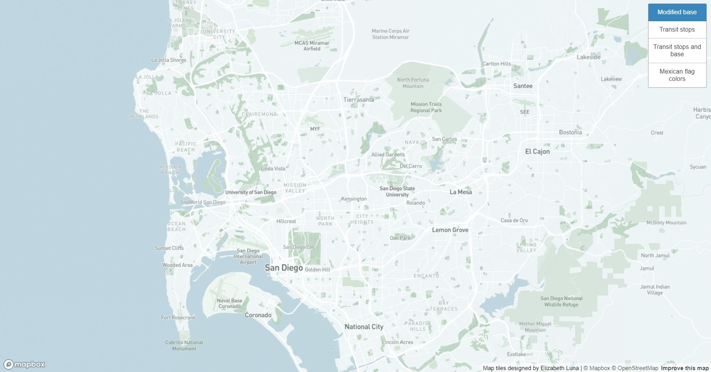
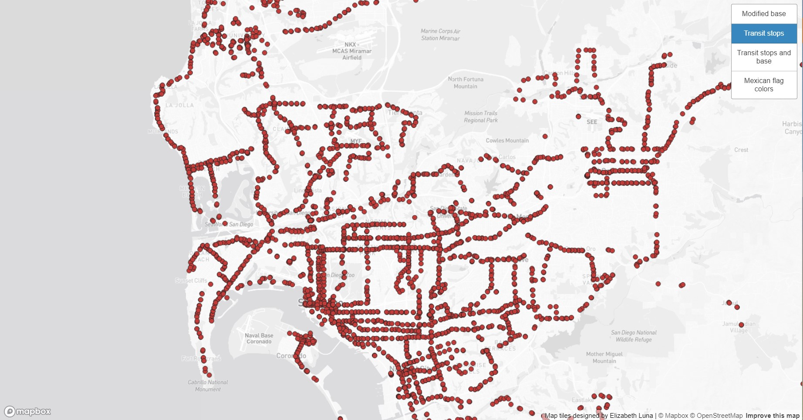

# Introduction

This map is intended to show different views of the geographical area of San Diego where I used to live when I was in high school. The map layers demonstrates their selected attribute. All layers are able to be zoomed in quite closely, even up to individual streets. 

The screenshots aim to showcase the extensive region of San Diego and its adjacent cities, with an emphasis on the spatial distribution and organization of the map layers.

The first one is just a base map that has been tailored to offer a clear depiction of the geographical landscape, minimizing extraneous details to enhance the viewer's comprehension of the area's layout.

In the second layer, it is demonstrating the available transit stops throughout the city of San Diego. The dots each represent a transit stop, which gives the viewer an idea of where the most of the transit stops are located.

The third layer retains the core concept of the second layer but introduces a revamped base map. This adjustment enhances user-friendliness through the inclusion of additional colors and features

