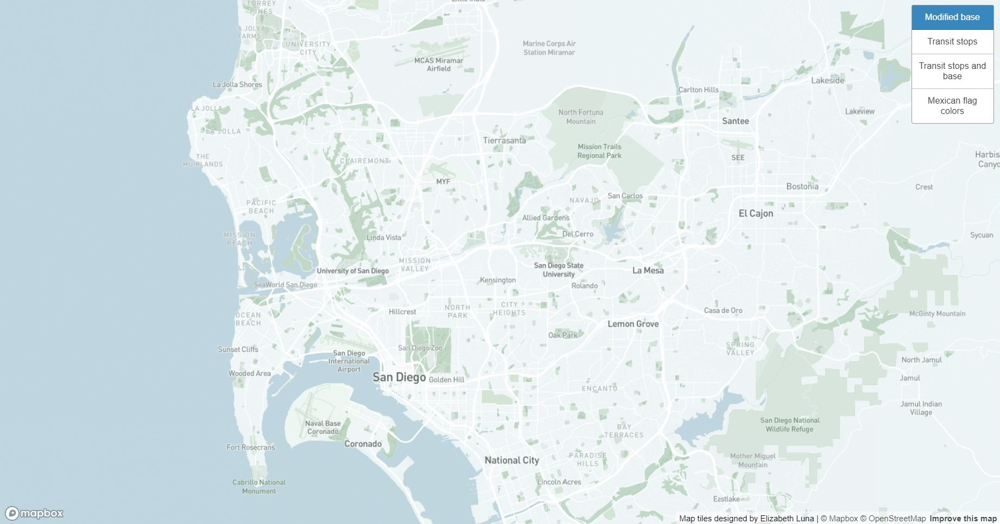
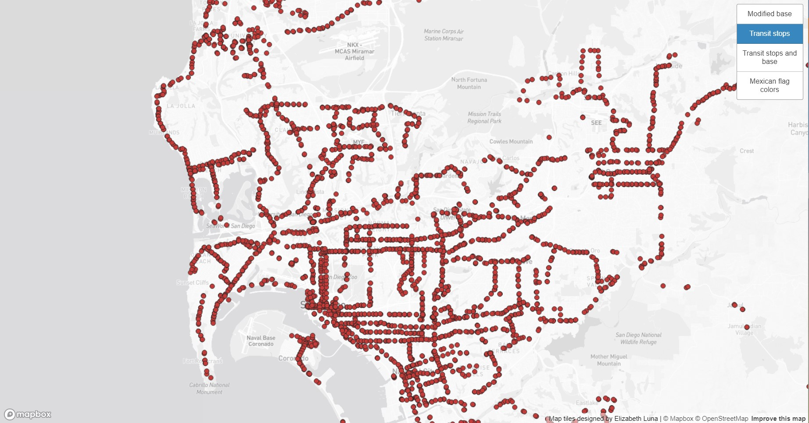
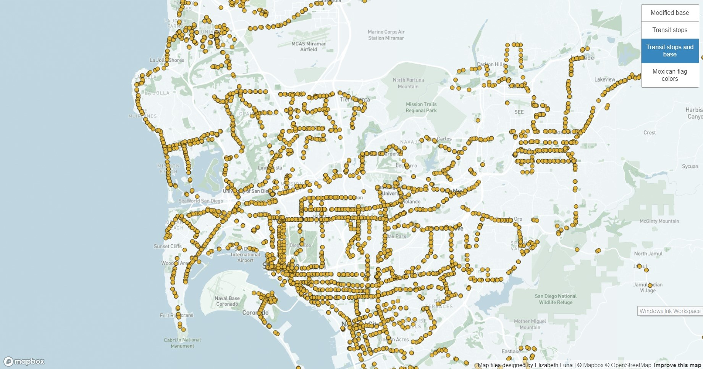
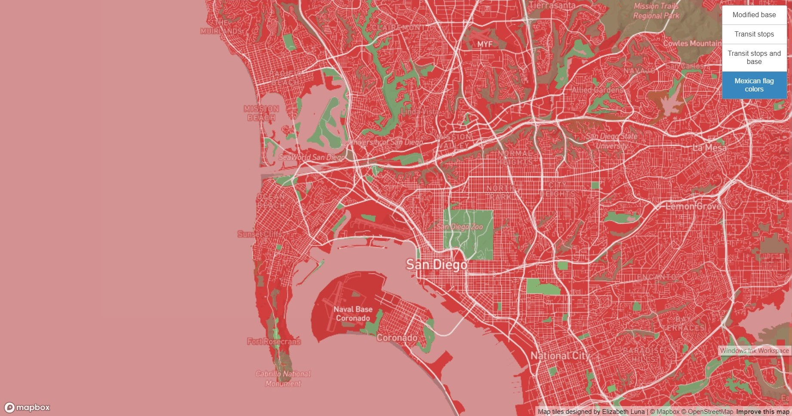

# Introduction

This map is intended to show different views of the geographical area of San Diego with map layers demonstrating their selected attribute. The map can be viewed at [this](https://elilsan.github.io/Lab4-Metatiles/) site. All layers are able to be zoomed in quite closely, even up to individual streets. The zoom level of the following screenshots are to demonstrate the vast area of San Diego and neighboring cities, and to give more space on how the layers are visualized.

From the following generated map layers, the first one was intended to be the modified version of the basemap "monochrome," provided by mapbox. This layer provides the viewer with an clear view of the geographical area without the added details.

In the second layer, it is demonstrating the available transit stops throughout the city of San Diego. The dots each represent a transit stop, which gives the viewer an idea of where the most of the transit stops are located. This data was sourced from the [city of San Diego website](https://data.sandiego.gov/datasets/transit-stops/), which provided various datasets available to the general public.

In the third layer, it is essentially demonstrating the same idea from the second layer, except with a modified base map. This makes it more user friendly, because of the added colors and elements.

Lastly, the fourth layer is a map layer that is designed over mapbox, which represents the colors of Mexico's flag, which is a nod to San Diego's large Latino community, which a majority are Mexican-American.

